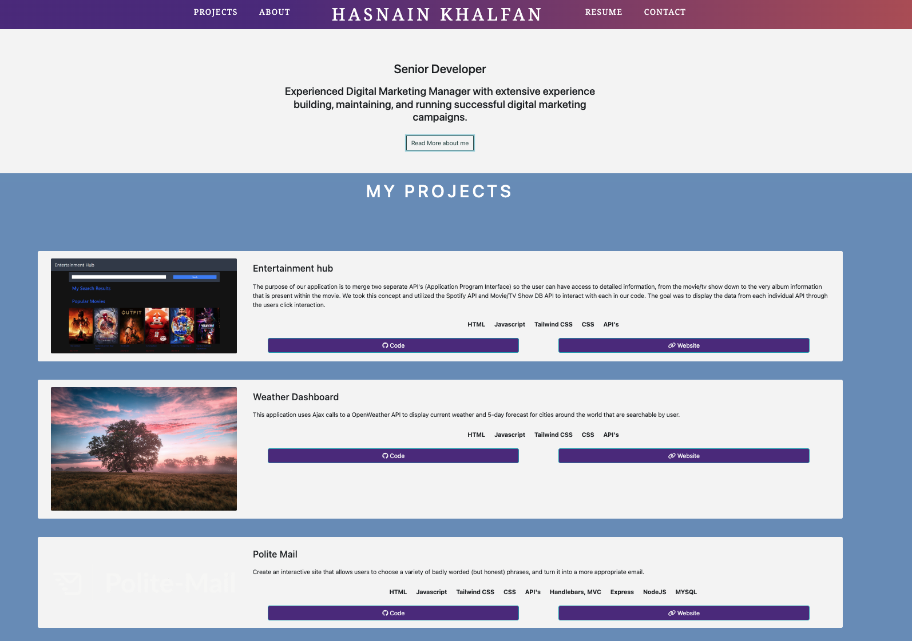

# React Portfolio

## Table of Contents

- [Description](#description)
- [Technology](#Technology)
- [Installation](#installation)
- [Usage](#usage)
- [License](#license)
- [Contribution](#contribution)
- [Questions](#questions)

## Description:

This project is showcasing my portolio as a full stack developer using React.

- [Deployed Site](https://hkhalfan1979.github.io/react-portfolio/)
- [project repo](https://github.com/hkhalfan1979/react-portfolio)

## Technology:

Project is created with:
- HTML
- CSS
- Javascript
- React
- React Scroll


## Installation

To run this project, install it locally using npm:

```
npm install
```

## Usage

After installing npm packages, the application will be invoked by using the following command:

```
npm start
```

## Website Screenshot



## License

[](https://opensource.org/licenses/MIT) <br>
This project is licensed under MIT, for more information please visit [this website](https://opensource.org/licenses/MIT)

## Contribution

Hasnain Khalfan

## Questions?

Please feel free to contact me if you need any further information:

- [Email](mailto:hkhalfan9@gmail.com)
- [Github Profile](https://github.com/hkhalfan1979)